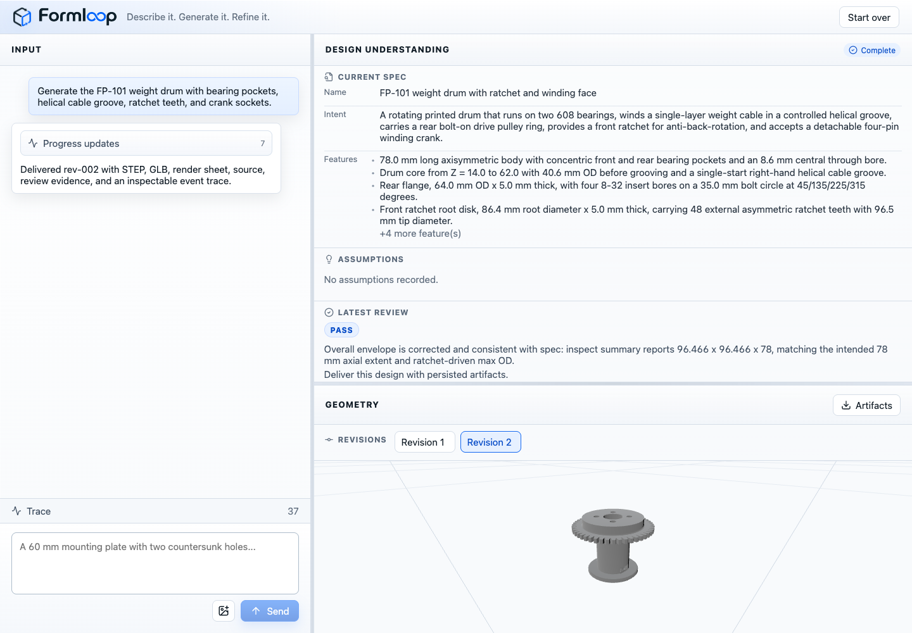

# Formloop

**Formloop is an agentic CAD workspace that turns natural-language mechanical
intent into inspectable geometry, review feedback, and traceable artifacts.**

It is built around a closed loop: capture the user's fit/form/function intent,
generate CAD through constrained tools, persist STEP/GLB/render artifacts,
review the result against the normalized spec, and revise when the evidence
says the part is not good enough yet.



## Why It Matters

Formloop is not a one-shot prompt-to-mesh demo. It is a full-stack prototype for
agentic engineering work where the important question is not just "did an agent
make something?" but "can a human or developer inspect why this candidate was
accepted, what artifacts were produced, and how the system would improve it?"

- **Agent orchestration with clear ownership**: manager, CAD Designer, Reviewer,
  Judge, Narrator, and bounded direct research calls each have explicit roles.
- **Deterministic CAD boundary**: Formloop orchestrates; `cad-cli`, `build123d`,
  and Blender own build, inspect, render, and comparison primitives.
- **Traceable product state**: every run keeps the prompt, normalized spec,
  assumptions, revisions, artifacts, review output, and event history.
- **Human-friendly review UI**: React/Vite workspace with chat, design
  understanding, review status, artifact downloads, revision history, and a
  Three.js GLB viewer.
- **Eval-first development culture**: repeatable datasets and reports combine
  deterministic geometry metrics with structured judge output.

See [SPEC.md](SPEC.md), [REQUIREMENTS_HARNESS.md](REQUIREMENTS_HARNESS.md), and
[REQUIREMENTS_UI.md](REQUIREMENTS_UI.md) for the current product contract.

## What You Can Do

- Start a design run from a plain-English part request.
- Add an optional PNG/JPEG reference image for visual review.
- Watch live progress narration while the harness normalizes, builds, reviews,
  and delivers a revision.
- Inspect the normalized current spec, assumptions, latest review outcome, and
  revision history.
- Orbit/pan/zoom the latest GLB in the browser.
- Download authoritative STEP, presentation GLB, render sheet, model source,
  manifest, revision metadata, and review artifacts.
- Continue the same design thread with follow-up revision requests.
- Run developer evals against known-truth datasets.

## Quick Start

```bash
# inside the formloop/ directory
uv sync --extra dev
cp .env.example .env.local     # add OPENAI_API_KEY

uv run formloop doctor
uv run formloop run "a 20mm cube" --profile dev_test
```

`uv sync` installs `cad-cli`, `build123d`, and CAD helper libraries into one
shared virtualenv. No separate `uv tool install` step is needed. Run artifacts
land under `var/runs/run-NNNN/`.

The `dev_test` profile is useful for plumbing checks. Normal design runs and
evals use the `normal` profile, which makes real model/tool calls.

## Use The Browser UI

The web UI lives in `web/` and talks to the harness over the polling HTTP API.

For local development with Vite hot reload:

```bash
uv run uvicorn formloop.api.app:app --host 127.0.0.1 --port 8765
npm --prefix web install
npm --prefix web run dev
```

Then open the Vite URL, usually `http://127.0.0.1:5173/`.

For the same-origin operator surface:

```bash
npm --prefix web install
npm --prefix web run build
uv run formloop ui start
uv run formloop ui status
```

`formloop ui start` serves the API and the built `web/dist` assets from
`http://127.0.0.1:8765/` by default.

### UI Workflow

1. Enter a design request in the input pane.
2. Attach one optional PNG or JPEG reference image if the part is visually
   constrained.
3. Watch progress updates while Formloop normalizes the spec, generates a
   candidate, persists artifacts, and reviews the result.
4. Use **Design Understanding** to confirm the current spec, assumptions, and
   latest review status.
5. Use **Geometry** to switch revisions, inspect the GLB, and download artifacts.
6. Send a follow-up request to revise the active design thread.
7. Expand **Trace** when you need the event-level execution history.

## Use The CLI

Run a single design request:

```bash
uv run formloop run "a 60 mm mounting plate with two countersunk holes"
```

Useful flags:

- `--profile dev_test` for lower-cost smoke validation.
- `--quiet` to suppress live narration.
- `--verbose` to include structured milestone payloads.
- `--no-color` for plain terminal output.

Run and revision artifacts are written under `var/runs/`. STEP is the
authoritative geometry artifact; GLB is the primary browser presentation
artifact.

## Run Evals

Developer evals are first-class. A case usually includes a prompt, normalized
spec, ground-truth STEP, optional reference image, tolerances, and tags.

```bash
uv run formloop eval run datasets/basic_shapes --workers 5
uv run formloop eval report latest
```

Batch outputs include deterministic metrics, judge outputs, per-case artifacts,
aggregate summaries, and failure shortlists.

## Architecture

The harness follows a manager-led, deterministic outer workflow:

1. create or resume a run
2. maintain the normalized current spec
3. fan out bounded research when needed
4. ask the CAD Designer for source
5. build/inspect/render through `cad-cli`
6. persist a revision bundle
7. review the candidate
8. revise or deliver

Specialists handle adaptive reasoning, but application code owns lifecycle,
state transitions, persistence, and revision-loop decisions.

## Live Narration

The harness emits a two-channel progress stream: machine-readable milestone
events (`spec_normalized`, `revision_built`, `review_completed`, and friends)
plus short LLM-written narrations from a lightweight Narrator agent. The CLI and
UI both surface the latest narration inline while preserving full structured
history for debugging.

## Build123D Part-Library Support

The CAD Designer agent carries guidance for Build123D core primitives,
operations, and installed extension libraries:

- `bd_warehouse` for parametric fasteners, bearings, threads, flanges, pipes,
  sprockets, and gears
- `py_gearworks` for involute, cycloid, and bevel gear generation

This keeps CAD source authoring grounded in available libraries while preserving
the rule that deterministic geometry execution belongs in `cad-cli`.
